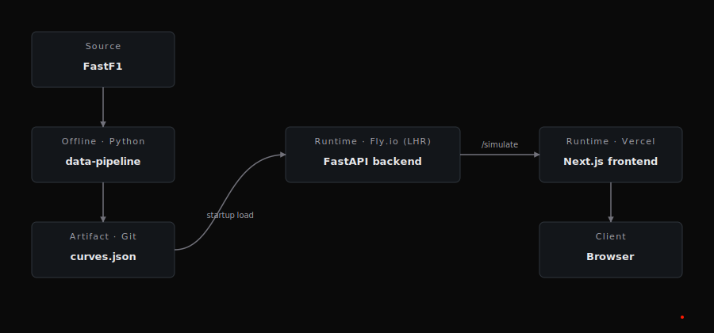

# Pit Wall

An F1 race-strategy simulator. Pick a historical race, drag pit stops on a lap timeline, swap tyre compounds, and watch predicted total race time update live — grounded in per-compound degradation curves fitted from real FastF1 stint data and calibrated so the recorded winner's strategy lands at zero delta.

**Live:** [the-f1-pit-wall.vercel.app](https://the-f1-pit-wall.vercel.app) · **API:** [pit-wall-api.fly.dev](https://pit-wall-api.fly.dev/health)



## What it does

- Three curated races: Bahrain 2023, Hungary 2023, British 2024.
- Drag pit markers on the timeline (←/→ to nudge, Delete to remove). Swap compounds per stint. Everything re-simulates on a 150 ms debounce.
- Delta vs. actual winner shows whether your strategy is faster (green) or slower (red) than the real race. Calibrated per-race so the winner's recorded strategy = 0.
- Every simulation returns warnings when a stint is extrapolated beyond the fit's valid range or when a compound's R² is weak — the model is honest about where it's guessing.

## Physics model

Each lap time is:

```
lap_time = base_lap_time
         + (compound_intercept + compound_slope × stint_lap)   # linear tyre deg
         + fuel_kg_remaining × 0.035                           # fuel penalty
         + calibration_offset                                  # per-race bias correction
         + pit_loss                                            # only on pit laps
```

Compound curves are OLS fits over clean FastF1 laps (safety cars, in/out laps, and yellow-flag laps filtered). The calibration step, run once at app startup, adjusts `calibration_offset` so that running the simulator on the recorded winner's strategy matches their recorded total time. This pins the deltas to something meaningful — without it, the model's systematic bias (~70 s on a 90-minute race) drowns out any strategy signal.

The model is a deliberately simple deterministic baseline. It does **not** yet model: slipstream/DRS, traffic, tyre cliff behaviour, compound warm-up windows, track evolution, or safety-car probability. See `backlog` below.

## Stack

| Layer | Tech |
| --- | --- |
| API | FastAPI · Pydantic · loguru · uv |
| Sim | Pure Python 3.13, dataclasses, microseconds per call |
| Pipeline | FastF1 → OLS fit → `curves.json` |
| Frontend | Next.js 16 (App Router, Turbopack) · React 19 · TypeScript strict · Tailwind 4 · shadcn/ui · TanStack Query · Recharts |
| Hosting | Fly.io (LHR, autostop) · Vercel |
| CI | GitHub Actions — lint, typecheck, tests, auto-deploy on `main` |

## Local dev

```bash
# Backend — http://localhost:8080
cd backend && uv sync && uv run uvicorn pit_wall.main:app --port 8080 --reload

# Frontend — http://localhost:3000
cd frontend && pnpm install && pnpm dev
```

Frontend defaults to `http://localhost:8080` for the API. Override with `NEXT_PUBLIC_API_URL` if needed.

Tests:

```bash
cd backend  && uv run pytest
cd frontend && pnpm test
```

## Deploy

- **Backend** — pushing to `main` triggers the `backend.yml` GitHub Action which runs tests then `flyctl deploy --remote-only`. CORS origins are set via `fly secrets set ALLOWED_ORIGINS=…`.
- **Frontend** — Vercel autodetects pushes, builds with `NEXT_PUBLIC_API_URL` baked in from the project env.

## Repo layout

```
backend/
  pit_wall/
    api/          routes, middleware, schemas, error envelope
    sim/          simulator, validator, fuel model, calibration
    data/         RaceCurves model + curves.json
    main.py       FastAPI app factory + lifespan calibration
  tests/          52 tests, <1 s
frontend/
  app/            App Router pages
  components/     Timeline, StintBreakdown, LapTimeChart, ResultsPanel, etc.
  lib/            api client, query hooks, types, strategy state machine
  __tests__/      Vitest + Testing Library
docs/             design spec + milestone plans
assets/           architecture diagram
```

## Backlog (post-M6)

- **Richer tyre model** — nonlinear cliff behaviour, temperature/compound warm-up, driver-specific degradation factor
- **Safety-car sampling** — probabilistic SC/VSC injection with delta expectation
- **Traffic/slipstream** — lap-time adjustment when running in a pack vs. clean air
- **More races** — expand beyond the three curated from FastF1
- **Strategy suggest** — grid search the pit-lap × compound space and surface optimal strategies

## Licence

MIT
